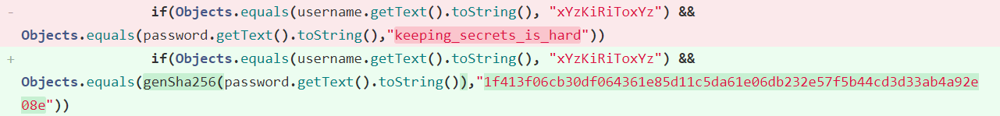

## DSO-NUS 2020 - FlashyLighty/Sekrets

The APK from the FlashyLighty challenge is also the same as the one in Sekrets.

> Bling bling flashlight by day, diary by night

> What?? A secret activity?
> I wonder how many apps have these..

## Introduction

*During the CTF, Sekrets was solved before FlashyLighty, so we shall follow in that order to maximize realism in the re-enactment.*

Opening the app, we are immediately confronted with a dialog saying "Root detected", accompanied by a most accusatory message:


Perhaps the challenge author is unaware of a CTF's purpose, so we shall give them the benefit of the doubt.

For mobile challenges, I use a device running Magisk with a module running frida-server. MagiskHide is usually sufficient to hide root from apps that have self-rolled root detection. Unfortunately, this comes with [RootBeer](https://github.com/scottyab/rootbeer), which is much more advanced.

At this juncture, it is better to disable MagiskHide altogether as it

- Literally does not do its job
- Messes with Frida, which is far better at doing its job

## A Brief Android Primer

MagiskHide used to work by using Inotify to watch the device filesystem. When an application is opened, Magisk can detects this interaction with the app's APK and can work its cloaking magic. 

However, it now uses the more sophisticated method of ptracing the Zygote process. This process is responsible for forking new processes for applications, so it is much more reliable than an indirect monitoring method such as Inotify. Since the Zygote process is already ptraced by Magisk, it will block other attempts to ptrace on it.

Some good readings on this:

- [Zygote process](https://medium.com/masters-on-mobile/the-zygote-process-a5d4fc3503db)
- [MagiskHide](https://medium.com/csg-govtech/diving-down-the-magisk-rabbit-hole-aaf88a8c2de0)

Incidentally, Frida has to use Zygote in order to remotely start applications and perform early hooking on the main activity. It's a surprise tool that will help us later.

In order to bypass root, we can use Frida to overwrite all the relevant RootBeer checks to return false:

```js
Java.perform(function(){
    var RootBeer = Java.use("com.scottyab.rootbeer.RootBeer"); 
    
    RootBeer.detectRootManagementApps.overload().implementation = function(){
        return false;
    };
    RootBeer.detectPotentiallyDangerousApps.overload().implementation = function(){
        return false;
    };
    RootBeer.detectTestKeys.overload().implementation = function(){
        return false;
    };
    RootBeer.checkForBusyBoxBinary.overload().implementation = function(){
        return false;
    };
    RootBeer.checkForSuBinary.overload().implementation = function(){
        return false;
    };
    RootBeer.checkSuExists.overload().implementation = function(){
        return false;
    };
    RootBeer.checkForRWPaths.overload().implementation = function(){
        return false;
    };
    RootBeer.checkForDangerousProps.overload().implementation = function(){
        return false;
    };
    RootBeer.checkForRootNative.overload().implementation = function(){
        return false;
    };
    RootBeer.detectRootCloakingApps.overload().implementation = function(){
        return false;
    };
    RootBeer.checkForMagiskBinary.overload().implementation = function(){
        return false;
    };
    RootBeer.isRooted.overload().implementation = function(){
        return false;
    };
});
```

This should remove all traces of libel and allow us to proceed with an spotless conscience.

## Unravelling Secrets

Decompiling the APK with [jadx](https://github.com/skylot/jadx), we can utilize some advanced sleuthing techniques to uncover the secret activity.


The username is obvious enough:

```java
// SuperSekretActivity.java
if (Objects.equals(SuperSekretActivity.this.o.getText().toString(), "xYzKiRiToxYz")) {
    // ...
    // Password validation
}
```

After the username is validated, the password is hashed and bitmasked:

```java
MessageDigest instance = MessageDigest.getInstance("SHA-256");
instance.reset();
byte[] digest = instance.digest(password.getBytes());
StringBuilder sb = new StringBuilder(digest.length * 2);
int length = digest.length;
for (int i = 0; i < length; i++) {
    sb.append(String.format("%02x", new Object[]{Integer.valueOf(digest[i] & 255)}));
}
str = sb.toString();

// ...

if (Objects.equals(str, "1f413f06cb30df064361e85d11c5da61e06db232e57f5b44cd3d33ab4a92e08e")) {
    SuperSekretActivity superSekretActivity = SuperSekretActivity.this;
    String password = superSekretActivity.p.getText().toString();
    Objects.requireNonNull(superSekretActivity);
    char[] charArray = password.toCharArray();
    try {
        charArray[0] = (char) (charArray[0] ^ ' ');
        charArray[1] = (char) (charArray[1] ^ 'V');
        charArray[2] = (char) (charArray[2] ^ 'V');
        charArray[4] = (char) (charArray[4] ^ 'X');
        charArray[6] = (char) (charArray[6] ^ ' ');
        charArray[9] = (char) (charArray[9] ^ ' ');
        charArray[12] = (char) (charArray[12] ^ 'V');
        charArray[14] = (char) (charArray[14] ^ 'F');
        charArray[16] = (char) (charArray[16] ^ 'X');
        charArray[17] = (char) (charArray[17] ^ 'F');
        charArray[20] = (char) (charArray[20] ^ '!');
        charArray[22] = (char) (charArray[22] ^ ' ');
	}
    // ...
    // Flag is constructed from charArray
}
```

The manipulation to the password is problematic since the AND operator is **non-invertible**. Every 0 bit in the result could be either a 1 or 0 in the original hash. If we had the actual hash we could optimistically brute-force the password, but this drastically expands the solution space.

We can't just skip over the check with Frida either; the actual password is used to construct the flag through a series of XORs after verification -- the password must be hidden elsewhere.

---

Curious, we turned to look at the actual activity within the application. The only reference to this activity is found in `b.b.a.b.java`, but that is gated behind what seems to be the FlashyLighty challenge (and a whole lot of work). We shall deal with that later.

Since Frida allows us to override implementations, we can just create our own intent to start the SuperSekretActivity:

```js
// Run with frida -U --no-pause -l script.js -f com.dso.flashylighty
// The --no-pause switch is required for early instrumentation

Java.perform(function() { 
    var intent = Java.use('android.content.Intent');
    var MainActivity = Java.use("com.dso.flashylighty.MainActivity");
    var SSA = Java.use("com.dso.flashylighty.SuperSekretActivity");
    MainActivity.onCreate.overload("android.os.Bundle").implementation = function(var_0) {
        this.onCreate.overload("android.os.Bundle").call(this, var_0);
        var ssaIntent = intent.$new(this, SSA.class);
        this.startActivity(ssaIntent);
    }
});
```

A login page appears, with the background being perfect example of irony. Along the sides of the image are Braille alphabet that spell out **GITLABROCKS** repeating. 


I admit it took an embarrassing amount of time trying various combinations of the letters in the password before remembering we had a username. Heading to xYzKiRiToxYz's GitLab page and looking at the diff for the commit "Oops":



Entering the correct username and password yields the flag in a dialog.

## FlashyLighty

The MainActivity loads a library with the native methods `gimmie` and `specialK`.  Ostensibly, this has to do with some time-based manipulation that hops between the `b.b.b.a` class and the variables of MainActivity:

```java
// b.b.b.a.java
MainActivity mainActivity = this.f787b;
if (!mainActivity.q) {
    mainActivity.u = SystemClock.elapsedRealtime();
    MainActivity mainActivity2 = this.f787b;
    long j = mainActivity2.u - mainActivity2.t;
    mainActivity2.v = j;
    mainActivity2.w = ((double) j) / 1000.0d;
}
MainActivity mainActivity3 = this.f787b;
mainActivity3.q = false;
mainActivity3.t = SystemClock.elapsedRealtime();
MainActivity mainActivity4 = this.f787b;
if (mainActivity4.specialK((int) Math.round(mainActivity4.w)) == 10101) {
    int i = mainActivity4.s + 1;
    mainActivity4.s = i;
    if (i == 4) {
        mainActivity4.s = 0;
        mainActivity4.gimmie((int) Math.round(mainActivity4.w), "zjMl+G^(j{}Gz+kLG~Wj{+");
        Toast.makeText(mainActivity4.o, "Check logcat!", 0).show();
        mainActivity4.startActivity(new Intent(mainActivity4, SuperSekretActivity.class));
    }
}
```

Particularly interesting is the call to `gimme` that takes in an encrypted string. Using IDA to look at `libflashylighty.so`, we see that the bulk of this function is just XORing:

```
; rax contains encrypted string
; first 128-bits (16 characters)
movdqu  xmm0, xmmword ptr [rax]
movd    xmm1, ebp
pxor    xmm2, xmm2
pshufb  xmm1, xmm2
pxor    xmm1, xmm0
movdqa  [rsp+48h+var_48], xmm1
; remaining 6 characters
mov     al, [rax+10h]
xor     al, bpl
mov     [rsp+48h+var_38], al
mov     al, [rbx+11h]
xor     al, bpl
mov     [rsp+48h+var_37], al
mov     al, [rbx+12h]
xor     al, bpl
mov     [rsp+48h+var_36], al
mov     al, [rbx+13h]
xor     al, bpl
mov     [rsp+48h+var_35], al
mov     al, [rbx+14h]
xor     al, bpl
mov     [rsp+48h+var_34], al
mov     al, [rbx+15h]
xor     al, bpl
mov     [rsp+48h+var_33], al
mov     [rsp+48h+var_32], 0
```

The `pxor, pshufb` trick is pretty cool:

- `pxor xmm2, xmm2` clears the `xmm2` register

- If we interpret the 128-bit `xmm*` registers as a 16-byte array, then `pshufb a[16], b[16]` simply does:

  ```c
  // SIMD; not a loop over i
  // unsigned right shift; checking MSb
  xmm1[i] = (b[i] >> 7) ? 0 : a[b[i] % 16];
  ```
  
- Each byte in `xmm1` is set to `xmm1[0]`

Since `bpl` is the lower 8 bits of `ebp` or `xmm1[0]`, each character is getting XORed with the **same value**! We can skip over the clock shenanigans in the class (as well as `specialK`), and brute-force this XOR cipher with a single-byte key.

