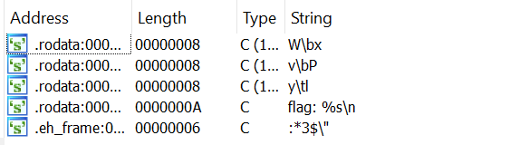
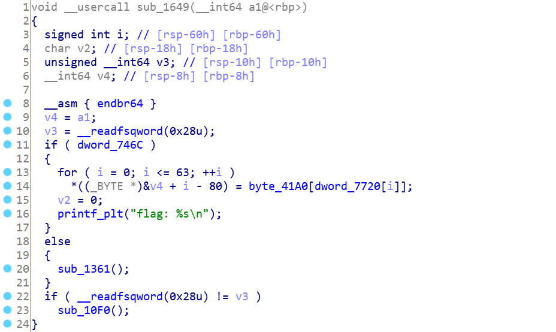
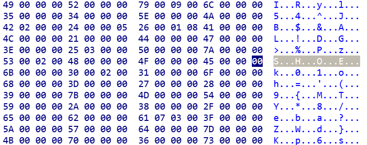
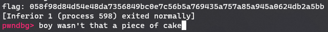
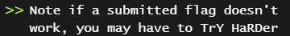
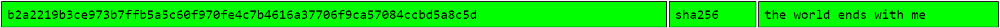

# DSO-NUS 2021 - NyaVM

> Help! It seems that my VM snapshot has problems with Meowing...
> Can you help me fix my VM's Meow and recover my real flag?

## Introduction

Running the binary presents the user with a menu:

```
-------------------------------------
Welcome to Meow VM Terminal!
-------------------------------------
Select an action:
1. Load VM snapshot
2. Run VM
3. Pause VM
4. Meow in VM
5. Quit
>
```

Not much is noteworthy here, besides the fact that option 4 presents you with a most helpful *boom?!*.

Looking at the binary with IDA, we are presented with suspiciously few strings



From experience, CTFs are out to toy with the feelings of already sleep deprived individuals. Bearing this in mind, we look at the references of the flag format string.



This function appears to be assigning characters one-by-one to the *supposed* flag by using a lookup table `byte_41A0` with offset table `dword_7720`. Such a method of obfuscation would explain why few strings are found, as we would at least expect the strings of the initial menu to be present. Looking at the hex view, this is indeed the case:



We find a bunch of values the appropriate *stride* apart and a shoe.

So far this is looking good -- the string is 64 characters long just as the flag should be. We can jump straight to this function in gdb and we're awarded the flag!



Submitting this as the flag reaffirmed my trust issues, for we have once again been swindled by challenge creators. But wait -- there were two references to the flag format string! That must be the real flag then!

## Deception and Mockery

After a second round of being duped, our notice was drawn to a new part of the challenge description:



At this point, the prospects of future humiliation didn't look too good for us, and we can expect many more fake flags here on out.

There are several more functions that are similar that can be found by looking at the xrefs to `puts`. Taking down these offsets, the deobsfucation can be automated using a quick and dirty script:

```python
offsets = [0x1249, 0x12d5, 0x13d6, 0x13ed, 0x1479, 0x1505, 0x15a7, 0x16f7, 0x1799, 0x18e9, 0x198b, 0x1a42, 0x1ace, 0x1b75, 0x1c1c, 0x1cc3, 0x1d6a, 0x1e11, 0x1eb8, 0x1f5f, 0x2006, 0x20ad, 0x2154, 0x21fb, 0x22a2, 0x2349, 0x23f0, 0x2497, 0x253e, 0x25e5, 0x273f, 0x27e6, 0x288d]

# Break before main so we can jump to the deobfuscating function
# Break again in puts to print the string
gdb.execute('''
    set print repeats 0
    b* 0x55555555772f
    b puts
''')

with open("out", "w") as ff:

    base = 0x555555554000
    for x in offsets:
        out = gdb.execute(f'''
            r
            set $rip={base+x}
            c
            x/s $rdi
        ''', to_string=True)

        out = out[out.find("\"")+1:-2]
        ff.write(f"{hex(x)}: {out}\n")

gdb.execute("quit")
```

We get a bunch of possible strings that resemble a flag, but nothing seems to point to specifically one. Fortunately, we were able to utilize a lesser known technique called trying everything until it worked.

## Retrospection

In the process of writing this write-up, I had a hunch and fired up good old [CrackStation](https://crackstation.net/):



Perhaps this is an allusion to the game The World Ends With You, which interestingly has a company by the name of [CAT](https://twewy.fandom.com/wiki/CAT). 

Maybe this was the motivation behind naming the challenge **Nya**VM? Who knows.

