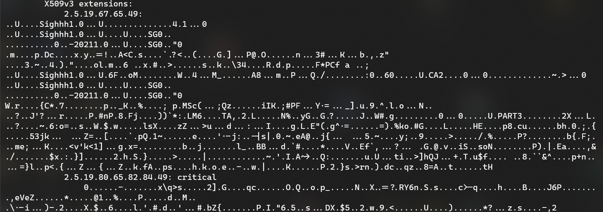

# DSO-NUS 2021 - Sighhh

> How about I use my private key to encrypt in public key cryptosystem?

## Introduction

We are presented with an X509 certificate encoded in the binary DER format, and a problem description that suggests we are dealing with a ciphertext encrypted using the private key. 

This is absolutely swell -- in order to decode the plaintext, we will need the public key, which is readily available from the certificate. We just have to figure out where the encrypted message is.

The certificate can be inspected with:

```bash
openssl x509 -inform der -in sighhh.der -text -noout
```

Everything looks fine except for the X509v3 extensions:



By no means am I an expert on cryptography, but something doesn't look quite right here. We seem to have binary data embedded in two separate extensions. Extracting these using a script:

```python
from cryptography import x509
import cryptography.hazmat.backends as backend

der = open("sighhh.der", 'rb').read()
cert = x509.load_der_x509_certificate(der, backend=backend.default_backend())

with open("cert.der", 'wb') as ff:
	ff.write(cert.extensions[0].value.value)
with open("msg", 'wb') as ff:
	ff.write(cert.extensions[1].value.value)
```

The first extension corresponds to another certificate in DER format, and the second being the ciphertext. From the output, the exponent **e = 65537**, and the modulus **n** can be obtained in a friendlier format with:

```bash
openssl x509 -inform der -in sighhh.der -noout -modulus
```

Hexdump the ciphertext using:

```bash
xxd -p cert1.sig | tr -d '\n'
```

## Decryption

Usually, sane RSA encryption uses the public key to encrypt, and requires the private key to decrypt. Specifically, we require the modular inverse **d** in the private key:

```
Encryption: m**e (mod n) -> c
Decryption: c**d (mod n) = m**(de) (mod n) -> m
```

The roles of **e** and **d** are reversed here, so we can obtain the plaintext message with python's modular exponentiation function:

```python
# Modulus
n = int("AEB08F314263A2EF6D8D651092B64EDEDC3F96F0828B71A55EBDBC3DE1041FE98B53CDDE3C1ADD3D302420560FDAA45E52C80298A7D5036E8B424636CEF36D87FA646A4E5635C8B5CBD310A2D919A52AE2ADB3B47BD7AC7AB6DC3ACFD257ADFE2ED0F10E02B453267C3173AFEC4B9E0E3975CA2B07CD46085BDDF561B8AF547EF656727D6965FAB3C4FDE2B50259337B1A2EB290B1B356E490E0ECA21BD7B1FD8A7DB1B50ADD680384ECE7D2D5FDD06D42FEDC2854B0AA8F90692C801BEF46E1AB53E44895519F3412FE40294514EE2F939937CAE5520F3D75FDCA4F8D3FB62670E77B45540EDCBCEA16676B36B2A71F3D969D4E9914CEB09784017FF90C78B5", 16)

# Exponent
e = 65537

# Ciphertext
c = int("30ea0eeedfd9db2d0fa4c9e4c809c5785c713e73be94ab832e325d94479b9bcc807163ae8ca588cdcb4fb551e29b6fd2705fc2e100088a4ee4185887073d3f935259366ee7538e738f8ff018633e2d71afa6b18c68cc8c8df542b9cdf2904a3650010985aeb28098932c6556655a9cf8bd8709932a83861bf1ae4031d70e25a0d5d6e650f484a49c9f64c3e04dd0120aa65c892d69c409cd292d0932fbe6ec1458fc24c79336e208fa8f6ca42708231b64fb1227c2f597231f625a7b9f97edf0b0f690500049b92236c935d61573aae5064458b02435d4c332ca77d939023c18a9e58f06ca5595c797c129098c858c09fb2a3fcee8ef7aff739110d7cc2d2c32", 16)

# Plaintext
m = pow(c, e, n)
```

Printing the plaintext in hexadecimal reveals some padding:

```python
>>> hex(m)
'0x1ffffffffffffffffffffffffffffffffffffffffffffffffffffffffffffffffffffffffffffffffffffffffffffffffffffffffffffffffffffffffffffffffffffffffffffffffffffffffffffffffffffffffffffffffffffffffffffffffffffffffffffffffffffffffffffffffffffffffffffffffffffffffffffffffffffffffffffffffffffffffffffffffffffffffffffffffffffffffffffffffffffffffffffffffffffffffffffffffffffffffffffff00496620796f752063616e2073656520746869732c206974206d65616e73207468617420796f752068617665207c2044534f2d4e55537b30323139373639376231353261326536'
```

Converting the lower bytes reveals the first part of the flag:

```python
>>> bytearray.fromhex("496620796f752063616e2073656520746869732c206974206d65616e73207468617420796f752068617665207c2044534f2d4e55537b30323139373639376231353261326536")
bytearray(b'If you can see this, it means that you have | DSO-NUS{02197697b152a2e6')
```

The `cert.der` extracted earlier also contains two extensions that are another certificate and ciphertext, and can be solved with the exact same method.

Piecing together the messages:

*If you can see this, it means that you have verified these messages with the right keys. Signing is not encryption.*

