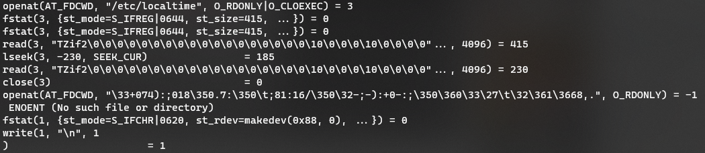
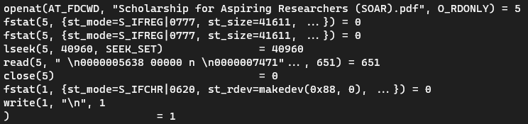

# DSO-NUS 2021 - SOAR

> Looking for a scholarship?
> Help us find the secret hidden in this one!

## Introduction

We get a PDF file about DSO's Scholarship for Aspiring Researchers. This is a reversing challenge, not an OSINT challenge, so the intended solution probably doesn't involve applying for this.

Runnings `strings` or looking at the hexdump suggests there is a `soar.zip` file hidden. The file can be easily extracted using `binwalk`, revealing an encrypted ZIP file. A frankly embarrassing amount of time was spent on this first obstacle. In our defence, we expected the password to be hidden somewhere in the PDF too. It is a reversing challenge after all, so we imagined it was stored in some spurious binary stream data or in some hidden layers.

In any case, the password is a thematic "dso". At some point we tried using the text in the PDF as a password, but passwords are case-sensitive. *Who knew!*

## The Real Challenge

The actual challenge reveals itself in a binary that promptly exits without printing anything when ran. We can `strace` the binary to reveal some interesting calls:



The binary reads from `/etc/localtime` that contains timezone information (TZif) and fails to open a file with an unholy name. 

We see the filename changes when we run it a second time:


These combined hints at the filename being generated from the system time.

Opening the file in IDA, we are greeted with a warning that the PLT stub might have been modified, and running `objdump` does indicate that we are not dealing with a regular PLT:

```
Disassembly of section .plt:

0000000000001020 <.plt>:
    1020:	ff 35 52 2f 00 00    	push   QWORD PTR [rip+0x2f52]        # 3f78 <_GLOBAL_OFFSET_TABLE_+0x8>
    1026:	f2 ff 25 53 2f 00 00 	bnd jmp QWORD PTR [rip+0x2f53]        # 3f80 <_GLOBAL_OFFSET_TABLE_+0x10>
    102d:	0f 1f 00             	nop    DWORD PTR [rax]
    1030:	f3 0f 1e fa          	endbr64 
    1034:	68 00 00 00 00       	push   0x0
    1039:	f2 e9 e1 ff ff ff    	bnd jmp 1020 <.plt>
    103f:	90                   	nop
    1040:	f3 0f 1e fa          	endbr64 
    1044:	68 01 00 00 00       	push   0x1
    1049:	f2 e9 d1 ff ff ff    	bnd jmp 1020 <.plt>
    104f:	90                   	nop
    1050:	f3 0f 1e fa          	endbr64 
    1054:	68 02 00 00 00       	push   0x2
    1059:	f2 e9 c1 ff ff ff    	bnd jmp 1020 <.plt>
    105f:	90                   	nop
```

This seems to be the result of a not-so-well documented linker option `-z bndplt`  on x86_64 that is explained in further detail [here](https://patchwork.ozlabs.org/project/glibc/patch/20170508185012.GA30569@intel.com/). After some hopping about, the `localtime` function is called through the functions at offsets **0x10f0** and **0x1040**.

Setting the result to a new struct with definition graciously stolen from the manual page:

```
struct tm {
    int tm_sec;         /* seconds */
    int tm_min;         /* minutes */
    int tm_hour;        /* hours */
    int tm_mday;        /* day of the month */
    int tm_mon;         /* month */
    int tm_year;        /* year */
    int tm_wday;        /* day of the week */
    int tm_yday;        /* day in the year */
    int tm_isdst;       /* daylight saving time */
};
```

The `tm_min` field is then used in a loop, the result of which is thrown into `fopen`. Treating this as a blackbox, we can spoof the time in order to hopefully get a more intelligible filename.

```bash
#!/bin/bash
for i in {0..60}
do
    faketime "00:$i:00" strace ./soar 2>&1 | grep openat | tail -1
done
```

When the minute is set to 11, the program tries to read from a "Scholarship for Aspiring Researchers (SOAR).pdf". Let's try renaming the challenge PDF to this and look at the `strace` logs again:



Nice! There's more activity here, with a call to `fseek` and `ftell`, but still no flag. From the disassembly, roughly what is happening to the PDF is:

```c
FILE* fp = fopen("Scholarship for Aspiring Researchers (SOAR).pdf", "r");
fseek(fp, 0, 2); // 2: SEEK_END
int x = ftell(fp);
int i = (x == (tm_min ^ (v93 + v89)) + 101606);
fclose(fp);
```

The program jumps to the end of the file, reads the file position indicator, and compares this to some constant. Strange -- this means only the size of the file is relevant, not whatever data is in it. Another giant blackbox is only executed if the comparison returns true. Spoiler: *it isn't*. The `tm_hour` field is then thrown into yet another blackbox which is responsible for the flag generation. 

There are two ways to work around this: 

1. Patch the `je` instruction into `jne` in the decision to enter the first blackbox
2. Inspecting the strings reveals a link to www.dso.org.sg/Media/Default/pdf/SOAR%20Insert.pdf with a substantially larger PDF that will pass this comparison

After the method of our choosing, the hour can be similarly brute forced with minutes fixed at 11, revealing the correct hour to also be 11.

```bash
faketime "11:11:00" ./soar
```
