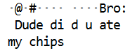

# STACK the Flags 2020 - I smell updates!

> Agent 47, we were able to retrieve the enemy's security log from our QA technician's file! It has come to our attention that the technology used is a 2.4 GHz wireless transmission protocol. We need your expertise to analyse the traffic and identify the communication between them and uncover some secrets! The fate of the world is on you agent, good luck.

**First blood!**

## Introduction

The challenge gives us a  `.pcap` file, so it's time to fire up the good ole Wireshark.

At a glance, the packet protocols are either `HCI_EVT`, `HCI_CMD` or `ATT` alluding to the [HCI interface Protocol](https://software-dl.ti.com/simplelink/esd/simplelink_cc13x2_sdk/1.60.00.29_new/exports/docs/ble5stack/vendor_specific_guide/BLE_Vendor_Specific_HCI_Guide/hci_interface.html) for Bluetooth. From the challenge description, we expect to see some sort of software update being conducted, so we can ignore all but the HCI data packets. There, we should be expecting to find some sort of binary data.

This can be done by specifying the filter: `hci_h4.type == 0x02`.

Quickly scrolling through the packets reveals some interesting strings in the ASCII columns of the hexdump:

| S/N  | String Fragment              |
| ---- | ---------------------------- |
| 129  | ... ELF                      |
| 160  | Bro: Dude did u ate my chips |
| 182  | /lib/ld- linu                |
| 185  | ... x-armhf.so.3             |



Frame 160 is an absolute masterpiece. Comedy has peaked with Frame 160, and I walk away from this challenge with a heavy heart, for I will never find anything nearly as funny for the rest of my life. Perhaps it is the manifestation of sleep deprivation and my broken sense of humour, but there is something indescribable about its comedic aesthetic. The broken "di d" from Wireshark's formatting, the incorrect past tense and the casual "Bro: Dude" all intertwine and elevate Frame 160 to the culmination of comedy.

But I digress. These are plaintext strings that can be found in a binary, indicating that our initial suspicion of a binary file transfer is correct. The binary appears to be transferred over frames with length **28 **(the last frame #1443 is truncated to **24**). 

These packets can be marked and then exported to a text file. Wireshark never seems to export binary data properly for me, so I have to go about parsing the packet dumps myself (`chunk.py`). 

## Reversing

Unfortunately, frames 182 & 185 tell us that this binary is using the linker for the armhf (ARM hard float) architecture, and I didn't have a Raspberry Pi or QEMU installed on my system. I did have [angr](https://github.com/angr/angr) though, so I used that to simulate and reverse the binary.

```python
import angr
import claripy

p = angr.Project("./dude_my_chips")

good = 0x10798	# prints "Authorised!"
bad = 0x107A8	# prints "Sorry wrong secret! An alert has been sent!"

flag_len = 8
flag_chars = [claripy.BVS(f"flag_char{i}", 8) for i in range(flag_len)]
flag = claripy.Concat(*flag_chars)

state = p.factory.entry_state(stdin=flag)
sm = p.factory.simulation_manager(state)
sm.explore(find=good, avoid=bad)
if len(sm.found) > 0:
    for found in sm.found:
        print(found.posix.dumps(0))
```