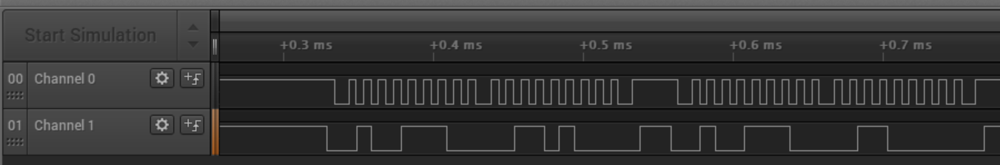
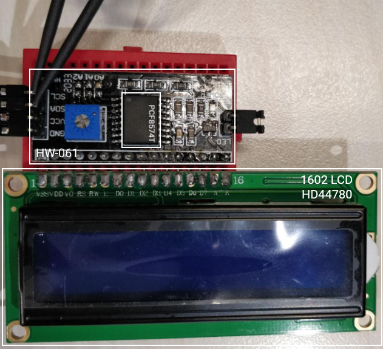
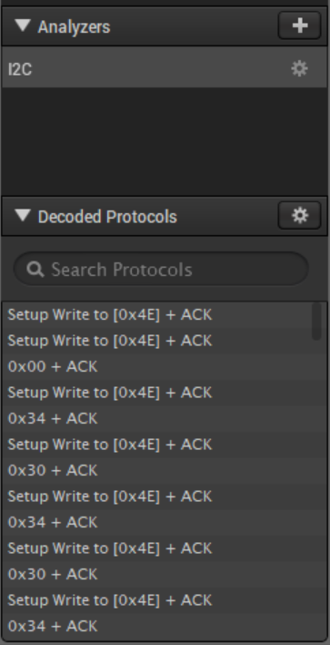
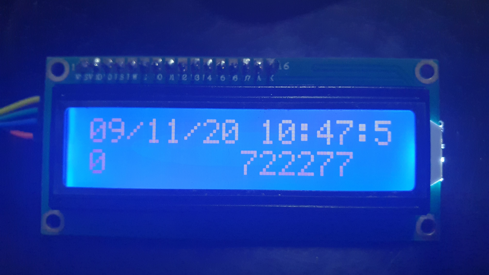

# STACK the Flags 2020 - IOT RSA Token

> We were able to get our hands on a RSA token that is used as 2FA for a website. From the token, we sniffed some data (capture.logicdata) and took some photos of the token. Lastly, we found a key written at the back of the token, the contents of which we placed into key.txt. Unfortunately, we dropped the token in the toilet bowl and it is no longer working. Using the data sniffed and the photos (rsa_token_setup.png and welcome_msg.png) taken, make sense of the data that is displayed on the rsa token, help us predict what the next rsa token will be!

**First blood and only solve!**

## Introduction

The challenge gives us a few files:

- `capture.logicdata` 
- Two images of the token and the start message (presumably)

The former contains recorded logic data (surprise!) that can be opened by [Saleae Logic Analyser v1](https://www.saleae.com/downloads/). Don't bother with the Logic 2 Alpha -- it doesn't have backwards compatibility and only supports another `.sal` file type.



We see that there are two channels, so the I2C protocol is already suspect. 



Looking at the image of the token, we can see we are dealing with the typical 1602 LCD going through some I/O expander using the PCF8574T chip. The module's label (HW-061) is obscured by the clips, which are connected to **SDA** and **SCL**. With this, we are most certainly dealing with I2C and not some scenario where the challenge dev trolls us by giving us 2 out of 3 SPI lines.

Saleae provides a built in protocol analyser to decode SPI, and the only work we need to do is to indicate which channel is SCL and SDA. The clock pin (SCL) can be easily determined by looking for the channel with a regular pulse. In this case, channel 0 is on SCL and channel 1 on SDA. 

If done correctly, we will see a preview of the decoded I2C data:



The data can be dumped to a CSV file, and we have two ways of proceeding:

1. Building the token using the hardware
2. Reversing the entire protocol

In a time-sensitive competition environment, the first step would probably be the smarter choice.

## Building the token

It turns out that the hardware solution is actually much faster, and simpler, to implement. Those are words I'd never thought I'd actually say, but it's true. The setup only requires a 16x2 LCD and a PCF8574T, which are *very* common (they are also, conveniently, often sold together), and a microcontroller (eg. Arduino). Using the hardware to effectively convert I2C signals into display characters not only saves us the trouble of poring over the HD44780 datasheet and painstaking effort of writing a script to decode the instructions *correctly* while keeping track of the LCD's state, but it also means we end up with an actual, physical, RSA token we can show to our friends, if we had any. I don't know about you, but I like to [*touch* my CTF solutions](https://www.youtube.com/watch?v=5TFDG-y-EHs), so this was the method we used.

#### The Setup

The goal here is to convert the I2C signals that we are given, and produce human-readable characters on the LCD display. 

To accomplish this, we first decode the raw logic signals using our logic analyzer, which gives us a sequence of I2C write commands stored on our computer. We then feed the commands over USB to an Arduino, which then performs the actual writes to the I2C connection with the IO expander. The rest is handled by the hardware.

This setup has the advantage of making use of publicly available, easy-to-use libraries to do most of our work, which dramatically cuts down the time required.

#### Computer to Arduino

The raw output of our logic analyzer (Saleae Logic Analyzer v1) looks like this:

```
Time [s],Packet ID,Address,Data,Read/Write,ACK/NAK
1.396227940000000,1,N,'0',Write,ACK
1.496450310000000,2,N,4,Write,ACK
1.496679830000000,3,N,0,Write,ACK
1.501438270000000,4,N,4,Write,ACK
1.501667660000000,5,N,0,Write,ACK
...
```

Here, we only need the "Data" column - the timing is not important for writing to the LCD; all the commands are writes to the same address; and ACK/NAK is an acknowledge signal to be written by the IO expander, not the Arduino. However, there is a small complication: for some inexplicable reason, analyzer formats the "Data" column in the most inconvenient way possible, so we have to process it. Here `'0'` refers to 0x00 byte, while `0` refers to the ASCII character 0 (0x30). The script used is shown below: (for the rest of the code see `arduino-i2c/utility.py`)

```python
def convertStr(string):
    # Where the magic happens - this is called on each line of the input text file
    # Converts poorly formatted string into nice integers so that we can feed it to arduino
    if(string=="' '"): # WHY
        return 32
    elif(string=="COMMA"): # IS
        return 44
    elif(string[0]=="'"): # FORMATTING
        return int(string.strip(string[0]))
    elif(string=="\\r"): # SO 
        return 13
    elif(string=="\\t"): # BAD
        return 9
    else:
        return ord(string)

# Loading analyzer output
dir=os.getcwd()
path=os.path.join(dir,"decoded_i2c.txt")
outPath=os.path.join(dir,"processed.csv")
in_data=pd.read_csv(path,sep=',')

# Processing data
vectConvert=np.vectorize(convertStr,otypes=[np.int32])
data_np=vectConvert(in_data["Data"].to_numpy())
print(data_np)

# Saving result
np.savetxt(outPath,data_np,fmt="%i",delimiter="\t")
```

Which gives us a consistent format where each line contains the decimal value of the byte to be sent over I2C:

```
0
52
48
52
48
...
```

This is then sent to the Arduino with the following script: (see `arduino-i2c/utility.py`)

```python
class sender():
    # For sending stuff to arduino
    def __init__(self,serialPath="/dev/ttyACM0",csvPath="processed.csv"):
        # Opens serial port and loads data from file
        self.serObj=serial.Serial(serialPath,9600)
        self.data=np.genfromtxt(os.path.join(os.getcwd(),csvPath),dtype=np.int32)
        self.index=0
        print(self.data)

    def send_a_bunch(self,n):
        # Sends n lines of data to Arduino
        startIndex=self.index
        for i in range(n):
            toSend=self.data[startIndex+i]
            toSend=(str(toSend)+"\n")
            print(toSend)
            self.serObj.write(toSend.encode())
            self.index+=1
            # Some delay is necessary to let the LCD respond
            time.sleep(0.1)
```

#### Arduino to LCD 

The Arduino then receives the data, and for each line it receives, sends the appropriate byte over I2C (see `arduino-i2c/iot-5.ino`) using Arduino's Wire library. Crucially, we have to first initialize the LCD display using the proper library (shown below). This is especially important because we want to use the display in 4-bit mode rather than the display's default 8-bit mode, and we don't know whether the decoded I2C contains the instructions to do so (and other instructions needed for proper initialization). In any case, there isn't any harm in initializing the display twice.

```c
#include <Wire.h>
#include <LiquidCrystal_I2C.h>

LiquidCrystal_I2C lcd(0x27,16,2);

void setup() {
  // initializes lcd and opens serial port
  Serial.begin(9600);
  lcd.init(); // sends instructions to use 4-bit mode, among other things
  lcd.backlight();
  delay(500);
  lcd.clear();
}
```

#### The Result

Putting everything together, we see a beautiful sight: hardware that actually works as intended, instead of short-circuiting everywhere and blowing up. The last screen displayed is shown below (the information on the other screens is shown in the next method):



## Reversing the entire protocol

Let's do a quick overview of the dumped data and extract the timestamp and packet data with a script.

In I2C, multiple peripheral devices can be connected on the same data lines, so before every bunch of packets, the controller has to indicate which peripheral device is the intended recipient. This is what we're seeing as "Setup Write to [<addr>]" in Saleae.

```
==> bits.txt 

1.396227940000000 (0x4E)	00000000
1.496450310000000 (0x4E)	00110100
1.496679830000000 (0x4E)	00110000
1.501438270000000 (0x4E)	00110100
1.501667660000000 (0x4E)	00110000
...
1.509070080000000 (0x4E)	00000000
1.509299530000000 (0x4E)	00001000
3.509102010000000 (0x4E)	00001100
3.509331520000000 (0x4E)	00001000
```

Most obvious is the fact that all writes are to address **0x4E**.  Also notice how each pair of subsequent packets differ only by the 3rd least significant bit if we excuse the existence of the first packet of zeroes. I suspect this is some artefact from the HW-061 powering up.

The alternating of the 3rd LSbit *looks* like some sort of enable or read/write pin, and instead of trial and error and tears, I find this an opportune time to impart the wisdom of my professor:

>*why you do like this why you never read datasheet*

It is time for us to consult the datasheets. The relevant ones are:

- 1602LCD ([Hitachi HD44780](https://www.sparkfun.com/datasheets/LCD/HD44780.pdf))
- [PCF8574T](https://www.nxp.com/docs/en/data-sheet/PCF8574_PCF8574A.pdf)

Ostensibly, the HW-061 datasheet is some sort of highly classified document because it is nowhere to be found. This is but a minor inconvenience.

#### Very basic primer on I/O expanders

Suppose all but 2 of your controller's I/O pins were already occupied, but you *really wanted* to attach this peripheral with a seemingly unholy 8 pins.

Instead of connecting the 8 pins directly to our controller, we connect them to the I/O expander, which for an I2C variant like the HW-061, only requires 2 pins to the controller board to attain full control over all 8 pins. The controller writes a byte value over I2C to the I/O expander, which maps each bit of this byte to the digital value of the 8 pins. Not having a schematic for the HW-061 is slightly problematic because we can't be sure which bit corresponds to which LCD pin.

For this challenge, things are simplified by only having one device connected through the HW-061 -- you can see how the 1602LCD takes a whopping 16 pins and so it is usually used with this I2C backpack.

Unsurprisingly, the 0x4E address refers to our HW-061 in its default configuration. In actuality, we are writing to the I2C address 0x27, and the 0x4E is equal to `(0x27 << 1) | 0` where the last bit is R/W̅ (Table 4) .

*Note:* The overline on W indicates active on digital LOW (0). Correspondingly, R would be active on digital HIGH (1).

#### Parsing packets

We can supplement this gap in our reversing by looking at libraries used to drive these LCD displays like [LiquidCrystal_I2C](https://github.com/johnrickman/LiquidCrystal_I2C). With the expected behaviour of pins from the datasheet and the bitmasks from the library, we can confirm that the bit-to-pin correspondence looks like:

```
               +-------+-------+-------+-------+------+-----+------+------+
PACKET START > |  DB4  |  DB5  |  DB6  |  DB7  |  BL  |  E  |  RW  |  RS  |
               +-------+-------+-------+-------+------+-----+------+------+
```

The 1602LCD is actually operating in 4-bit interfacing mode, where **DB0-DB3** are left unused. This lines up with the initialization code of the library and Fig. 24 of the HD44780 datasheet:

```
==> packets.txt

1.496450310000000 (0x4E)	[  |  | E|  ]	0011  	// (1)
1.501438270000000 (0x4E)	[  |  | E|  ]	0011  	// (1)
1.502052140000000 (0x4E)	[  |  | E|  ]	0011	// (1)
1.502670870000000 (0x4E)	[  |  | E|  ]	0010	// (2)
1.503284610000000 (0x4E)	[  |  | E|  ]	0010	// (3)
1.503748450000000 (0x4E)	[  |  | E|  ]	1000	// (3)
1.504272210000000 (0x4E)	[  |  | E|  ]	0000	
1.504736040000000 (0x4E)	[  |  | E|  ]	1100
1.505199940000000 (0x4E)	[  |  | E|  ]	0000
1.505663770000000 (0x4E)	[  |  | E|  ]	0001
1.508142160000000 (0x4E)	[  |  | E|  ]	0000
1.508606120000000 (0x4E)	[  |  | E|  ]	0110
```

Upon power on, the LCD is on 8-bit interfacing mode by default. What we observe in these packets is the initialization process outlined in Fig. 24:

1. Using the top 4 bits of the instruction register, set LCD to 8-bit interface 3 times
2. Partial function set to change LCD to 4-bit interface
3. With LCD now in 4-bit mode, properly configure with another function set

In 4-bit mode, two packets are read into the instruction register, first the top nibble then the bottom. We can incorporate this into our script and output the corresponding instruction from Table 6:

```
==> instructions.txt

FN SET = 4 BIT / 2 LINE / 5x8
DISPLAY ON / CURSOR OFF / BLINK OFF
CLEAR DISPLAY
ON R/W INC 
RET HOME
WRITE  
WRITE g
WRITE o
WRITE v
WRITE t
WRITE e
WRITE c
WRITE h
WRITE  
WRITE c
WRITE t
WRITE f
WRITE  
SET DDRAM = 0x80	// newline
...
```

We have successfully decoded the entire I2C-to-LCD protocol! Although the instructions are interesting to look at, we should be more concerned with what is displayed on the LCD:

```
==> parsed.txt

================
 govtech ctf 
 welcome to iot 
================
 username: 
 govtechstack 
================
 password:    G0
vT3cH!3sP@$$w0rD
================
 key: deeda1137a
b01202 
================
 Qns of the day
 ?????????????? 
================
When was govtech
 founded? 
================
p.s the time was
 9:06:50 GMT+08 
================
09/11/20 10:44:5
0       461177 
================
09/11/20 10:45:5
0       107307 
================
09/11/20 10:46:5
0       233790 
================
09/11/20 10:47:5
0       722277 
```

We are nearly at the end of the challenge! The flag is within grasp of our fingers, hurrah! Euphoria does not come close in describing this feeling of elation. It would be terrible if this happiness were to be suddenly disrupted.


## Reversing SecurID

Life is full of surprises, and sometimes ones that are not so good. At this stage, we are only halfway through the challenge. Let this be a life lesson to us all, that [determination](https://www.behavioraleconomics.com/resources/mini-encyclopedia-of-be/sunk-cost-fallacy/) and perseverance will eventually prevail.

We have the username and password for the portal, and what seems like 4 previously generated tokens. The key is in our possession, but the encryption algorithm used is not obvious. 

#### Time for OSINT

The 6-digit tokens and challenge description allude to the algorithm being that used by the RSA SecurID tokens. These also operate on 128-bit AES tokens, which is similar to our key.

Unfortunately, the token generator code is not open-sourced. There are some libraries like [PyOTP](https://github.com/pyauth/pyotp) or [otplib](https://github.com/yeojz/otplib), but they are based off the [RFC 6238](http://tools.ietf.org/html/rfc6238) specification for time-based one-time passwords instead. The only library compatible with the RSA proprietary specification is [stoken](https://github.com/cernekee/stoken), but it isn't exactly documentation friendly for our purposes.

A StackOverflow answer mentioned some leaked source on [SecLists](https://seclists.org/bugtraq/2000/Dec/459). As a good rule of thumb, any website that looks like it was done with HTML1 in the 1990s is a good source for hacking material (look at Phrack!). 

#### Investigating the program

The source is split into 3 parts:

- Macros and bit-twiddling functions
- SecurID functions
- Utility functions and `main`

It isn't immediately obvious as to what this code does, but from reading `main`, it is clear that the SecurID functions are only called through `securid_hash_time`. For our purposes, we can all the functions prepended with `securid` as a blackbox:

```c
// Only this function is called from main
void securid_hash_time (unsigned long time, OCTET *hash, OCTET key) { ... }
// Inputs: time, *hash, key
// Output: data modified in *hash
```

`OCTET` is a union that allows for accessing values using different byte sizes.

The main function starts off by opening a reading three arguments off the command line. A file pointer `fi` is opened with the first argument, the filename of the token file. 

```c
// Loop through tokenfile
// Each line corresponds to an encrypted token
for (;;)
    {
		// EOF 
        if (read_line (fi, data)) return 1;
        // Read serial number of token
    	j = data->D[1];
        if (read_line (fi, data)) return 1;
        if (j == serial)
        {
            // Found the token corresponding to our serial
            // Set this as our key
            key.Q[0] = data->Q[0];
            break;
        }
    }
```

From this we can see that the second argument, the serial number, corresponds to some truncated portion of the key. It is supplied at runtime for the sole purpose of finding the correct key for the particular token from the `tokenfile.asc` which presumably can contain multiple keys.

```c
unsigned char read_line (FILE *fi, OCTET *outb)
{
	...
    if (*s == '#') s++;
    if (strncmp (ins, "0000:", 5) == 0) return -1;
	...
}
```

We can also tell that `read_line` expects to read a line in the format `#0000:...` and subsequently performs some decryption on it. Our key is 16 character hex string, so we can skip all this and directly set that as our key!

#### More Reversing

At this point, it is clear that we aren't working with the source code for the token generator, but a token *verifier*. This is a program that will be running on some server in a RSA backroom somewhere that validates peoples' OTPs. Understanding the purpose of this program will make it easier in rationalizing what the rest of the program is doing.

```c
t = (time (NULL) / 60 - 0x806880) * 2; 
// (t & -4) for 60 sec periods, (t & -8) for 120 sec periods, etc.

// Find time drift
// 0x40560/2 = 60*24*366 (seconds in a year rounded up)
for (i = (t & -4), j = (t & -4) - 4; i < (t & -4) + 0x40560; i += 4, j -= 4)
{
    securid_hash_time (i, &hi, key);
    securid_hash_time (j, &hj, key);
    if ((hi.B[0] == input.B[2]) && (hi.B[1] == input.B[1]) && (hi.B[2] == input.B[0]))
    {
        j = i; k = (i - (t & -4)) / 2;  break;
    } else if ((hi.B[3] == input.B[2]) && (hi.B[4] == input.B[1]) && (hi.B[5] == input.B[0]))
    {
        j = i; k = (i - (t & -4)) / 2 + 1; break;
    } else if ((hj.B[0] == input.B[2]) && (hj.B[1] == input.B[1]) && (hj.B[2] == input.B[0]))
    {
        i = j; k = (j - (t & -4)) / 2;  break;
    } else if ((hj.B[3] == input.B[2]) && (hj.B[4] == input.B[1]) && (hj.B[5] == input.B[0]))
    {
        i = j; k = (j - (t & -4)) / 2 + 1; break;
    }
}
if (i != j)
{
    printf ("Either your clock is off by more than 1 year or invalid token secret file.\n");
    return -1;
}
if (k)
{
	printf ("\nToken is %s your clock by %d minute%s.\n\n", (k > 0) ? "ahead of" : "behind", abs (k), (abs (k) == 1) ? "" : "s");
}
else
{
	printf ("\nToken clock is synchronised with yours.\n\n");
}
```

The RSA token doesn't have network connectivity (and for good reason too), and thus will never be able to synchronize with the server time through an NTP server. As good as real-time clock modules are, they *will* start to drift over time. Time-based OTP tokens usually expire within a minute or two, so what happens after the RTC on the physical token drifts out of this range? What do the folks at RSA do to circumvent this?

The assignment of `t` is similar to the definition of a timestep in RFC 6238 (4.2), which uses:


where float division is truncated to an integer and

- refers to the current time
- is some starting epoch
-  is the timestep size

The epoch in this case is defined at the 1st January 1986 00:00:00. Why this epoch? I have absolutely no idea. Perhaps the program author wanted to commemorate the satellite flyby of Halley's comet. Who knows.

The multiplying by 2 is perhaps better interpreted as a bitshift to the left by one. Bitmasks are used in the program to round times:

```
// Using 8-bit widths for t as an illustration
60 sec periods:  (t & -4) = (t & 0b11111100) = Clear 2 LSbits
120 sec periods: (t & -8) = (t & 0b11111000) = Clear 3 LSbits
```

Once the exact time drift is found, the program generates tokens for the next 10 timesteps:

```c
for (j = 0; j < 40; j += 4)
    {
        securid_hash_time (i + j, &hi, key);
        printf ("%X : %02X%02X%02X\n", i + j, hi.B[0], hi.B[1], hi.B[2]);
        printf ("%X : %02X%02X%02X\n", i + j, hi.B[3], hi.B[4], hi.B[5]);
    }
```

For reasons unbeknownst to me, the SecurID algorithm generates 2 valid OTPs per timestep. Interestingly, the 6-digit OTP is generated by concatenating 3 2-character hex values and isn't actually a decimal! No letters **a-f** appear even though it is interpreted as a hexadecimal value due to the `securid_convert_to_decimal` function in our SecurID blackbox. Again, no idea why, but I suspect it has to do with generating a more uniform output within **00-99** instead of truncating a decimal value to 2 digits.

#### Generating Tokens

Let's run the program with the 4 OTPs given to see if we have reversed it accurately. Removing the chunk handling file reading and with some modifications:

```c
// Set current number shown on screen
// Remember our OTP is actually a hex string!
input.D[0] = strtoul ("461177", &s, 16);

// Reverse byte order
key.Q[0] = 0x0212b07a13a1edde;

// 09/11/20 10:44:50
t = (1604890070 / 60 - 0x806880) * 2;

// In for loop
for (...) {
    ...
	printf ("%llu : %02X%02X%02X\n", (((i+j)/2+0x806880)*60), hi.B[0], hi.B[1], hi.B[2]);
	printf ("%llu : %02X%02X%02X\n", (((i+j)/2+0x806880)*60), hi.B[3], hi.B[4], hi.B[5]);
}
```

Running this modified program:

```
Token is behind your clock by 2 minutes.

1604889720 : 461177
1604889720 : 107307
1604889840 : 835746
1604889840 : 193775
1604889960 : 835746
1604889960 : 193775
1604890080 : 233790
1604890080 : 722277
1604890200 : 233790
1604890200 : 722277
1604890320 : 835746
1604890320 : 193775
1604890440 : 835746
1604890440 : 193775
1604890560 : 461177
1604890560 : 107307
1604890680 : 461177
1604890680 : 107307
1604890800 : 236795
1604890800 : 325533

OK
```

Great success! Now we just have to calculate the time drift for our token and supply that correction when calculating the timestep! That sounds easy enough, what could go wrong!

#### Things Go Terribly Wrong

We'd better make sure our time drift is consistent for all four OTPs, so we shall err on the side of caution and re-run the program three more times:

| Timestamp                      | OTP    | Time Drift (Token rel. to Server) |
| ------------------------------ | ------ | --------------------------------- |
| 09/11/20 10:44:50 (1604889890) | 461177 | - 2 minutes                       |
| 09/11/20 10:45:50 (1604889950) | 107307 | - 1 minute                        |
| 09/11/20 10:46:50 (1604890010) | 233790 | + 2 minutes                       |
| 09/11/20 10:47:50 (1604890070) | 722277 | + 3 minutes                       |

Clearly something is amiss, because RTCs do drift, but not on the scale of 1 minute per minute. At this level, you would attain better accuracy by attaching a sundial module to your token.

For a while, I worked on the assumption that this was because the *calculated* time drift was wrong due to how the for loop iterates. An OTP seems to appear multiple times in the output of the program, so maybe our time drift calculation was a fluke. Maybe the OTP with the correct time drift appears only later in the iteration?

Searching the solution space at up to 1 month in either direction yielded no results.

#### Generating Tokens (For Real)

We have completely overlooked something from the output of the LCD. Remember the Question of the Day: When was GovTech founded?

The RSA source code had a random epoch that was due to the creator's love of Halley's comet (presumably). Perhaps the challenge developer would be a larger fan of GovTech instead:

```c
// Final code in main
int main (int argc, char **argv)
{
    signed long long    t;
    OCTET               key, hi;

    // Reverse byte order
    key.Q[0] = 0x0212b07a13a1edde;

	// GovTech was founded on 1 October 2016
    // Using time 09:06:50 GMT+08
    t = ((time(NULL) - 1475284010) / 60) * 2;

	// We only need one OTP from this timestep
    securid_hash_time (t, &hi, key);
    printf ("%02X%02X%02X\n", hi.B[0], hi.B[1], hi.B[2]);

    // And re-running with old timestamps seems like the timestep
    // is actually 2 minutes apart so it might be this OTP instead
    securid_hash_time (t + 8, &hi, key);
    printf ("%02X%02X%02X\n", hi.B[0], hi.B[1], hi.B[2]);

    return 0;
}
```

Successfully entering these credentials downloads a zip file containing the flag.

## The Fast Way

We also found a faster way to get the flag, that doesn't require us to correct for the time drift by changing epochs. It might not be the intended solution, but it sure works. While playing with the code, we made an interesting observation: 

***Several of the 6-digit tokens keep appearing over and over again, even when the timestamp changed by months.***

How frequently? To find out, we generated every token within a ~1 month window, and tallied up the number of times each unique token appeared (see `token-generation/keygen-brute.cpp`). The assumption here is, of course, that the distribution of tokens in the real sequence is similar to the distribution in our generated sequence. If this assumption holds, rather than spending hours and hours *ahem* figuring out the problem and perfectly replicating the RSA token's behavior, we can just try the most frequently occurring 6-digit codes, perhaps using a script. 

If we do brute-force the logins, however, we can be more efficient by only generating half the tokens. This is because the tokens are generated in pairs for every 120s window, and the login server provides some leeway if the (physical) token's clock is slightly out of sync with the server's. This means that:

- The frequency of the 2nd token is strongly correlated with the frequency of the 1st
- If the 2nd token in a pair is accepted, the 1st one will probably be accepted as well 

Which means that we can probably get away with generating only the 1st token in each pair, and tallying their frequencies. The results are shown below (first column is 6-digit token, second is frequency):

```
Generating tokens between:
Mon Nov  9 08:42:00 2020
Thu Dec 10 18:02:17 2020
Total tokens generated:		22601
Number of unique tokens:	464
835746	6082
997494	1208
578454	1142
461177	1044
233790	962
...
```

Out of 22601 tokens generated in total, only 464 are unique, which means that an automated dictionary-attack that iterates over the 464 tokens wouldn't take very long. But it gets better (for us) - the top 5 most common tokens alone account for nearly half the tokens, which means trying those 5 already gives us a very good chance of getting in! 

Just out of curiosity, I also plotted the CDF of the N most common keys:


From this graph, we can see that N=10 has a ~55% success rate, with diminishing returns thereafter: N=40 gives a ~80% rate, while N=100 increases it to ~90%. 

At this point, we could still try an automated attack and iterate through all the tokens in our list, but why bother? Manually trying the top 5 keys already has a ~50% success rate (even "8935746" alone has a ~25% chance), and if those don't work, we can try again every 2 minutes anyways.


## Conclusion

This was an extremely entertaining challenge requiring understanding of various fields. Ended up being more like 90% reversing / 10% IOT-relevant stuff, but still learnt a lot and had great fun. 10/10 would solve again.


